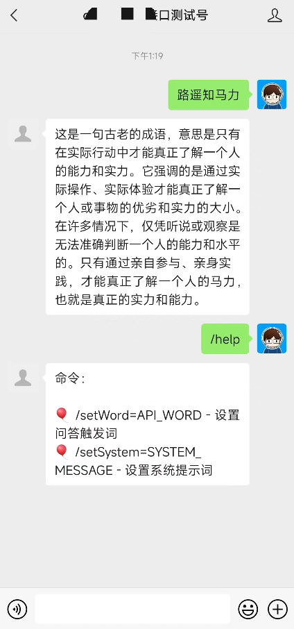

# BotChan · Bot酱

Bot酱使用微信测试号对接任何兼容OpenAI规范的API接口（例如[API+](https://apipl.us/?mtm_campaign=botchan)、[API2D](https://api2d.com/r/186008)），实现ChatBot。



## 安装和配置

### 准备资料

1. [访问并开通微信测试号](https://mp.weixin.qq.com/debug/cgi-bin/sandbox?t=sandbox/login)

将页面上的 appID、appsecret作为环境变量

```yml
- MP_APPID=appID
- MP_APPSECRET=appsecret
```
2. 随机编写一个Token

```yml
- MP_TOKEN=your-random-token
```

3. 设置 OpenAI 接口

> 如果要使用 OpenAI 官方接口，需要将镜像部署在海外，否则很可能网络不通

OpenAI 配置示例

```yml
- DEFAULT_API_URL=https://api.openai.com
- DEFAULT_API_KEY=sk...
- DEFAULT_MODEL=gpt-3.5-turbo
```

API2D 配置示例

```yml
- DEFAULT_API_URL=https://oa.api2d.net
- DEFAULT_API_KEY=fk...
- DEFAULT_MODEL=gpt-3.5-turbo
```

4. 设置触发词

可通过以下环境变量设置触发词，设置后只有包含触发词的对话才会触发AI答复。如果测试为空，那么每一句都可以触发AI答复。

```yml
DEFAULT_API_WORD=
```

5. 对话命令和默认参数锁定

设置的默认值可以通过 `/setXXX` 命令（针对每个人）进行配置，可通过 `/help` 查看。

但某些参数你可能不希望用户修改，可以用以下环境变量锁定：

```yml
LOCK_API_URL=true
LOCK_API_KEY=true
LOCK_API_WORD=true
LOCK_MODEL=true
```

6. 启动服务后（见后），记得将回调地址和Token回填到微信测试号设置页面。

### Docker

> 请按上文介绍修改环境变量

> 确保对 `./data` 有写权限，或者挂到有权限的地方去

```bash
docker run -d --name bot \
-e MP_APPID= \
-e MP_APPSECRET= \
-e MP_TOKEN= \
-e DEFAULT_API_URL=https://oa.api2d.net \
-e DEFAULT_API_WORD= \  
-e DEFAULT_API_KEY=fk... \
-e LOCK_API_URL=true \
-e LOCK_API_KEY=true \
-e LOCK_MODEL=true \
-e DB_TYPE=json \
-v ./data:/data \
-p 80:9000 \
easychen/botchan:latest
```
### Docker-compose

> 请按上文介绍修改环境变量

> 确保对 `./data` 有写权限，或者挂到有权限的地方去

复制 `docker-compose.example.yml` 为 `docker-compose.yml`，并根据需要修改环境变量：

```yml
version: '3'
services:
  bot:
    image: easychen/botchan
    environment:
      - MP_APPID=
      - MP_APPSECRET=
      - MP_TOKEN=
      - DEFAULT_API_URL=https://oa.api2d.net
      - DEFAULT_API_WORD=
      - DEFAULT_API_KEY=fk...
      - LOCK_API_URL=true
      - LOCK_API_KEY=true
      - LOCK_MODEL=true
      - DB_TYPE=json
    volumes:
      - ./data:/data
    ports:
      - 80:9000
```
启动服务

```bash
docker-compose up -d
```

> nodejs 安装见最后

## 回填Token和回调地址

启动服务后，我们可以获得`回调地址`。如果IP/域名是`xxx.xxx.xxx.xxx:xxxx`，那么`回调地址`是`http://xxx.xxx.xxx.xxx:xxxx/wechat`

> 如果你在本机测试，需要使用 ngrok 等内网穿透工具创建一个公网可以访问的域名

回到测试号设置页面，点击 `接口配置信息` 后的修改链接，会将 `回调地址` 和 `TOKEN`( 即 `MP_TOKEN` )  填入并保存。


## 使用

用微信扫描测试号设置页面的二维码，关注测试号以后，可以发送问题。也可以通过 `/setXXX` 命令进行针对个人的配置。

可以通过 `/help` 查看可用命令。

> 你可以将测试号「发送到桌面」，作为快速进入的入口。这样就不用在微信里边到处找了

## 高级配置

### 使用 NodeJS 架设服务

#### 包依赖安装

node18

```bash
yarn add api2d body-parser cors cross-fetch dotenv express express-xml-bodyparser knex mysql2 simple-json-db
```

node16.13.1 

```bash
yarn add api2d body-parser cors cross-fetch dotenv express express-xml-bodyparser knex mysql2@3.0.1 simple-json-db
```

启动服务 `node index.js` 端口 `9000`

### 将用户设置保存到数据库

默认情况下，用户设置保存在 `/data/db.json` ，这要求运行环境可写；你也可将用户设置保存在 MySQL中。

#### MySQL 表初始化

```sql
CREATE TABLE `data` (
  `id` int NOT NULL AUTO_INCREMENT,
  `key` varchar(255) NOT NULL,
  `value` text,
  PRIMARY KEY (`id`),
  UNIQUE KEY `key` (`key`)
) ENGINE=InnoDB DEFAULT CHARSET=utf8mb4 COLLATE=utf8mb4_general_ci;
```

#### MySQL 环境变量

```yml
- DB_HOST
- DB_PORT
- DB_USER
- DB_PASSWD
- DB_NAME
```

#### 切换用户配置保存模式

```yml
- DB_TYPE=mysql2
```

